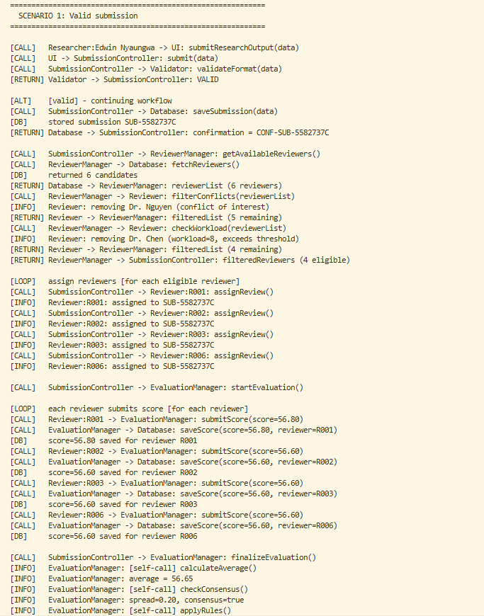
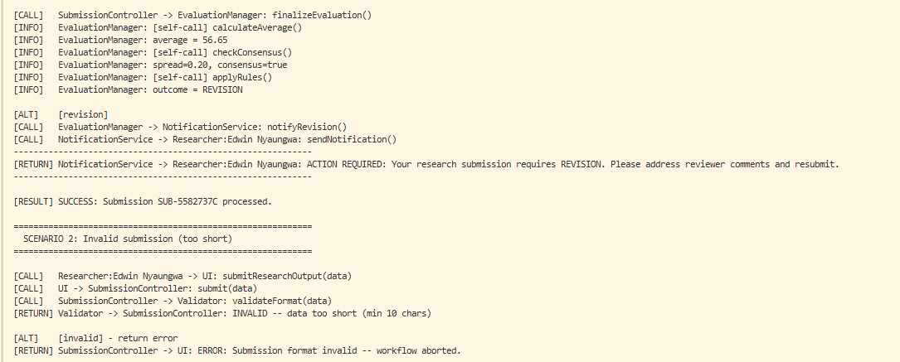
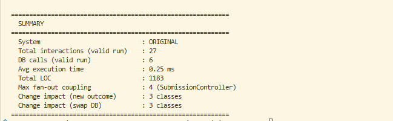
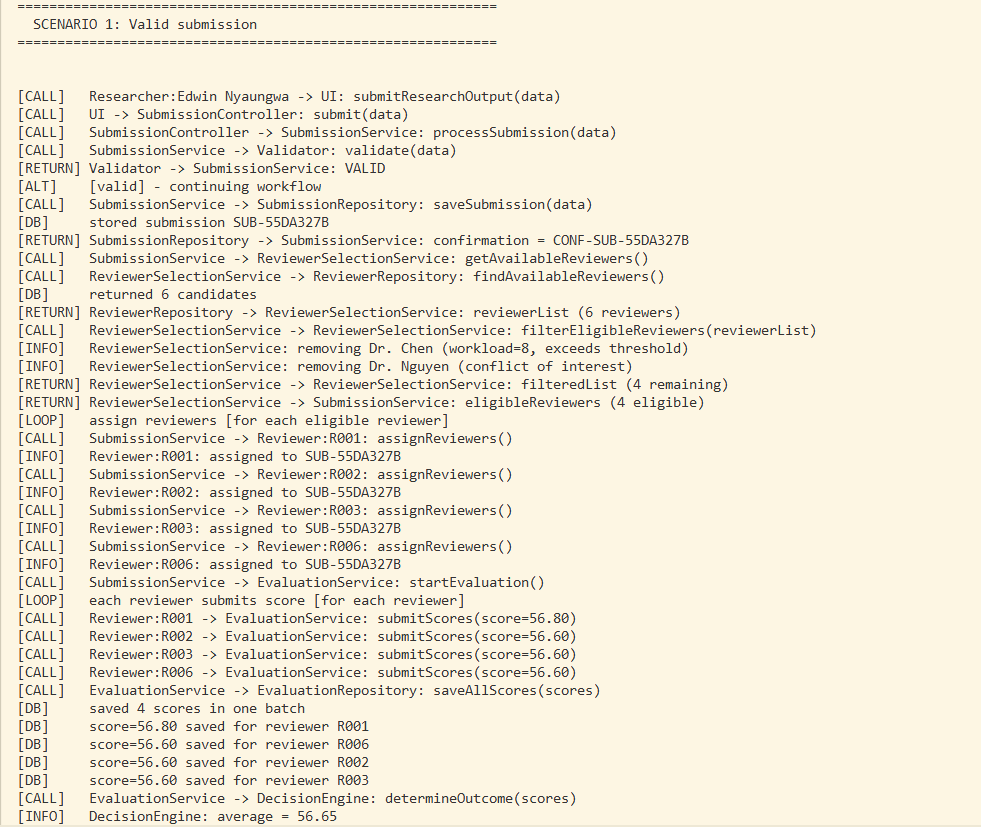
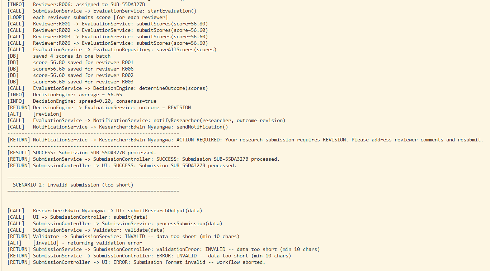
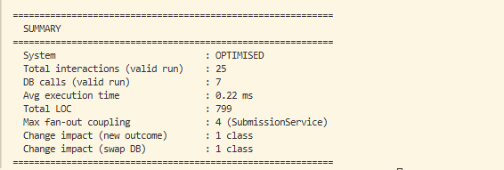

# COS 730 – Assignment 2
## From Behavioural Models to Optimised Implementation

> **Intelligent Submission and Review System**
> 
> University of Pretoria · Department of Computer Science
> 
> Student: Edwin Nyaungwa

---

## Repository Structure

```
SE/
├── Original/
│   └── backend/          # Task 1 - Baseline Java implementation (12 classes)
├── Optimised/
│   └── backend/          # Task 5 - Optimised Java implementation (16 classes)
├── screenshots/
│   ├── original_scenario1.png      # Original: valid submission trace
│   ├── original_scenario2.png      # Original: invalid submission trace
│   ├── original_metrics.png        # Original: empirical metrics report
│   ├── optimised_scenario1.png     # Optimised: valid submission trace
│   ├── optimised_scenario2.png     # Optimised: invalid submission trace
│   └── optimised_metrics.png       # Optimised: empirical metrics report
├── .gitignore
└── README.md
```

---

## System Overview

This project implements and empirically evaluates two versions of an Intelligent Submission and Review System - a baseline that faithfully preserves a flawed sequence diagram, and an optimised version that resolves all identified GRASP violations.

### Baseline (Original) — 12 Classes

| Component | Role |
|---|---|
| `SubmissionController` | Bloated controller - coupled to 4 components, handles 5 concerns |
| `Database` | Accessed directly by 3 components - no abstraction layer |
| `ReviewerManager` | Delegates filtering to wrong class (Reviewer delegate) |
| `EvaluationManager` | Exposes 3 internal self-calls; mixes evaluation, decision, and notification |
| `NotificationService` | 3 separate notify methods via scattered alt block |

### Optimised - 16 Classes

| Component | Role | Improvement |
|---|---|---|
| `SubmissionController` | Thin relay - 1 dependency | Was coupled to 4 classes |
| `SubmissionService` | Business orchestrator | New - absorbs controller logic |
| `SubmissionRepository` | Submission persistence | Replaces direct Database access |
| `ReviewerSelectionService` | Single `filterEligibleReviewers()` | Replaces 2 misplaced calls on Reviewer |
| `ReviewerRepository` | Reviewer data access | Decouples persistence from business logic |
| `EvaluationService` | Score coordination | Bulk `saveAllScores()` after loop |
| `EvaluationRepository` | Score persistence | New repository layer |
| `DecisionEngine` | Outcome decision | Replaces 3 exposed self-calls and alt block |
| `NotificationService` | `notifyResearcher(outcome)` | Replaces 3 separate methods |

---

## Prerequisites

| Tool | Version |
|---|---|
| Java JDK | 21+ |

Verify installation:
```bash
java -version
```

---

## How to Run

### Original (Baseline) Backend

```bash
cd Original/backend
javac *.java
java Main
```

### Optimised Backend

```bash
cd Optimised/backend
javac *.java
java Main
```

---

## Run in GitHub Codespaces (no local setup required)

1. Click the green **Code** button on this repository
2. Select the **Codespaces** tab
3. Click **Create codespace on main**
4. In the Codespace terminal:

```bash
# Run Original backend
cd Original/backend && javac *.java && java Main

# Run Optimised backend (open a new terminal tab)
cd Optimised/backend && javac *.java && java Main
```

---

## Output Screenshots

### Original — Scenario 1: Valid Submission



---

### Original — Scenario 2: Invalid Submission



---

### Original — Empirical Metrics Report



---

### Optimised — Scenario 1: Valid Submission



---

### Optimised — Scenario 2: Invalid Submission



---

### Optimised — Empirical Metrics Report



---

## Key Metrics Comparison

| Metric | Original | Optimised | Change |
|---|---|---|---|
| Total CALL interactions | 27 | 25 | -7% |
| DB round-trips per submission | 6 | 3 (bulk) | -50% |
| Filter method calls | 2 (wrong class) | 1 (internal) | -50% |
| Notification methods | 3 separate | 1 unified | -67% |
| Total classes | 12 | 16 | +4 focused classes |
| Total lines of code | 1183 | 799 | -32% |
| Largest class (LOC) | 240 (EvaluationManager) | 79 (ReviewerSelectionService) | -67% |
| Max cyclomatic complexity | CC=6 (EvaluationManager) | CC=4 (DecisionEngine) | -33% |
| Classes with 3+ responsibilities | 4 | 0 | -100% |
| Change impact: new outcome | 3 classes | 1 class | -67% |
| Change impact: swap database | 3 classes | 1 class | -67% |
| Avg execution time (1000 runs) | 0.25 ms | 0.22 ms | -12% |
| Peak execution time | 9.56 ms | 4.44 ms | -54% |

---

## GRASP Principles Applied in Optimisation

| Issue (Task 2) | Baseline Violation | Optimised Fix (Task 5) |
|---|---|---|
| Bloated controller | Controller Pattern | `SubmissionService` absorbs business logic |
| Wrong filter responsibility | Expert Pattern | `ReviewerSelectionService` owns filtering |
| Redundant filter calls | Low Coupling | Single `filterEligibleReviewers()` self-call |
| Exposed internal algorithm | High Cohesion | `DecisionEngine` encapsulates evaluation |
| Scattered alt decision block | Polymorphism | `notifyResearcher(outcome)` unified call |
| Direct database coupling | Indirection | Repository layer for all persistence |

---
